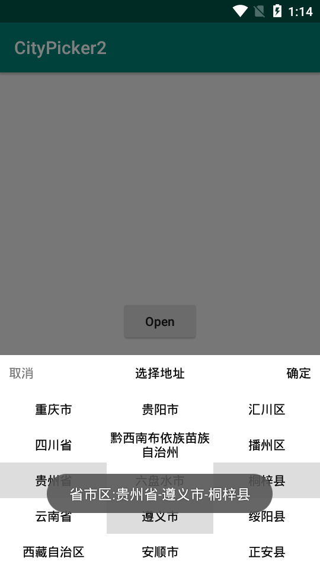

# CityPicker
## 中国城市选择器

### 1.一个简单的城市选择器
  数据来源: <a href="http://www.mca.gov.cn/article/sj/xzqh/2018/201804-12/20181201301111.html">2018年12月中华人民共和国县以上行政区划代码</a>

### 2.Screenshot
</img>

### 3.Demo
<a href="https://github.com/actor20170211030627/CityPicker/raw/master/captures/app-debug.apk">download apk</a>

### 4.USE使用
    //1.init in you application
    CityListLoader.getInstance().init(this);
    
    //2.use in activity
    CityPickerBottomDialog dialog = new CityPickerBottomDialog(this);
    dialog.setTitle("选择地址");
    dialog.setDimAmount(0.5F);//default = 0.5
    dialog.setOnSubmitClickListener(new CityPickerBottomDialog.OnSubmitClickListener() {
        @Override
        public void onSubmitClick(CityInfo province, CityInfo.CityListBeanX city, CityInfo.CityListBeanX.CityListBean district) {
            String address = String.format("省市区:%s-%s-%s", province.name, city.name, district.name);
            Log.e(TAG, "onSubmitClick: address=".concat(address));
            toast(address);
            dialog.dismiss();
        }
    });
    
    dialog.show();

## 5.How to
To get a Git project into your build:

**Step 1.** Add the JitPack repository to your build file

Add it in your root build.gradle at the end of repositories:
<pre>
	allprojects {
		repositories {
			...
			maven { url 'https://jitpack.io' }
		}
	}
</pre>

**Step 2.** Add the dependency, the last version:

	dependencies {
	        implementation 'com.github.actor20170211030627:CityPicker:version'
	}

### 6.TODO
<ol>
    <li>自定义item</li>
    <li>自定义item条数</li>
    <li>更新地址数据</li>
    <li>more...</li>
</ol>

### 7.Thanks:
  <a href="https://github.com/crazyandcoder/citypicker">citypicker</a>,
  数据来源参考了这个项目, 感谢作者

### 8.License 